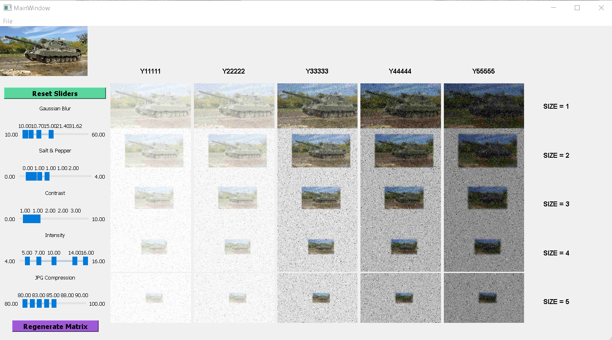

# Noisey-image

## Installation

To recreate the development environment to run and edit this project, it is highly recommended you installed Anaconda for package and Python version management. Creating an venv will also work, but pip package versions might not have correct conflict resolutions.

**Optimal Environment:**
- Python 3.7
- CUDA-enabled GPU (optional)
- Qt5 Packages (can be installed through `conda`)
- PyTorch >= 1.7 (and associating Torchvision version)
- Tested on Pop OS 20.04 LTS (you might find GUI elements misplaced on Windows and Mac OS)

**Anaconda Steps:**
1. Start an Anaconda shell
2. Create an environment: `conda create --name noisey python=3.7`
3. Installing FFMPEG and libx264: `conda install x264 ffmpeg=4.0.2 -c conda-forge`
4. Installing torch:
    - (CUDA): `conda install pytorch torchvision torchaudio cudatoolkit=11.3 -c pytorch` (adjust CUDA versions to your system's driver version)
    - (CPU-only): `conda install pytorch torchvision torchaudio cpuonly -c pytorch`
5. Install required packages: `pip install -r requirements.txt`

**virtualenv Steps:**
1. Create an environment: `python3 -m venv [NAME_OF_ENVIRONMENT]`
2. Activate environment (OS-dependent; [more info here - scroll down to "Activate [...]" section](https://www.infoworld.com/article/3239675/virtualenv-and-venv-python-virtual-environments-explained.html) )
3. Install packages via pip: `pip install -r requirements.txt`
    - NOTE: If pip complains about versions not existing and displays a version warning message, please update pip in your venv

To start the application: `python3 app.py`

## Augmentation Structure

The application's augmentation system was made to be very flexible in queuing augmentations, adding/removing augmentations, and editing parameters related to an augmentation. The main fixture of this system is the `AugmentationPipeline`, which is located within `src/transforms.py`. It takes in augmentation functions through a class wrapper called `Augmentation`. This wrapper class takes in the actual augmentation function, parameters, and other metadata that will used in the GUI.

To implement a new augmentation function, declare a function in `transforms.py` with a minimum argument signature: `image: numpy.ndarray, parameter1: Any, parameter2: Any`. Refer to the existing augmentations for reference. Once you've created your function, add it as a dictionary entry in `augList`, which will be read by `AugmentationPipeline`.

`auglist` requires:
- `function`: The actual augmentation function
- `default`: Default parameters for an experiment
- `example`: An example parameter to show in the `AugDialog` box

To see your new augmentation, just restart the application and click the "Add Augmentation" button.

## Testing Augmentations 
By default, there are three active augmentations with preset parameters and example parameters. They can be seen here:

You can reorder augmentations, delete them, or add them ("Add Augmentations" button).

To test different augmentations and different parameters, click the "Add Augmentations" button, and you will be presented with this window:

You can select a given augmentation to see an example, its Noise parameters, and an example parameter. To activate an augmentation, click the checkbox, and it will be added to the Augmentation pipeline when the "Ok" button is clicked.

**NOTE:** Changing example parameter doesn't change the "Preview" image in the Dialog window, but it does change the preview in the "Noisy" image in the main GUI. This will be fixed in an upcoming update.

## Testing CNNs with Augmentation Pipline:
Before starting a long experiment, one might want to quickly see how an augmentation or a set of augmentations might affect a given Convolutional Neural Network (CNN). This application supports two CNNs at the moment: YOLOv3 (Object Detection), and MIT Segmentation Model (Semantic Segmentation).

You can select the model you want to use by the drop-down on the bottom right:

**To preview**, click the "Run Preview" button. This will initialize the selected model and run it on the current image.

A sidebar is available to show the different classes. Clicking on an element on sidebar will isolate that given class. For example, in YOLOv3, we can filter only the cars:

To manage images, you can go over to the "images" tab on the sidebar. You will be presented with a list of current images. Clicking on a list item will load that given image to the main GUI. There you can run a preview on that image.

To add an image, just right-click on the sidebar, and select "Open" action in the context menu. Images can be added individually or *en masse* via a specified YAML file.

An example of *en masse* is loading in a YAML file in `./imgs/test_labels.yaml`. This will load in 4 images from a car dataset. YAML files can also be modified to include other data, like labels, for experiment evaluations.

**NOTE:** Caching old results if the Augmentation Pipeline stays the same is not implemented. Will be available in upcoming update.

## YOLO-NAS Pre-Trained Weights

In order to perform inference using any of the YOLO-NAS models, you will need to download the following files and place them in the corresponding directories:

[yolo_nas_s.pt](https://drive.google.com/uc?export=download&id=1xkZbZs_XkVZ4vmKqrg6sveOgyNnWPGhB) => /src/yolonas

[yolo_nas_s_arch_params.yaml](https://drive.google.com/uc?export=download&id=1aMGoI3jp0HUkgCLz9h9UFopL-MYKl_TL) => /src/yolonas

[yolo_nas_m.pt](https://drive.google.com/uc?export=download&id=1jMVzXevuJhqBXNoQ933OoUGhYL3lh0Gq) => /src/yolonas

[yolo_nas_m_arch_params.yaml](https://drive.google.com/uc?export=download&id=15YHYnat98IuAlEla8srbBFwrwfzXfmFS) => /src/yolonas

[yolo_nas_l.pt](https://drive.google.com/uc?export=download&id=1_RVlfwfZHDTYiPEzrlZ70uzWoB2mujov) => /src/yolonas

[yolo_nas_l_arch_params.yaml](https://drive.google.com/uc?export=download&id=1H-W8FTIvJhJbvN3iz99OJ4uitoM3iEu4) => /src/yolonas

[tank_v1-3_ckpt_latest.pth](https://drive.google.com/uc?export=download&id=1iCQQPFOJSXsF5wvqe_mK6o3bvxolqPj5) => /src/yolonas_tank

## Degredation Parameter Settings

From the main window, you can press the "Parameter Settings" button, colored in purple and located on the lower-right hand corner. This will open a new window that allows you to tweak the parameters of five select augmentations: Gaussian Blur, Salt & Pepper, Contrast, Intensity, and JPEG Compression.

From this new window, called the Tuning Panel, there are three main components: the original image, the sliders, and the augmentation matrix.

The original image is located at the top-left corner, and is the image that will be used as a template to generate all other augmentations on the matrix. You can change this image by clicking "File > Open Image" and selecting the image of your choice.

The sliders are a set of five multi-handle sliders for each of the aforementioned augmentations. Each slider itself has five handles, one the corresponds to each level. For example, the left-most handle corresponds to Level 1 and the right-most handle corresponds to Level 5. You can move each handle freely within the slider range. To enact these parameter changes, press the "Regenerate Matrix" button. To reset each of the sliders to their original positions, press the "Reset Sliders" button.

Covering the majority of the panel is the augmentation matrix. This is a 5x5 grid of augmented images from the original image. On the Y-axis are labels for each Size augmentation, ranging from Level 1 (top row) to Level 5 (bottom row). Along the X-axis are labels for each column, denoted as "Y11111" through "Y55555", where Y corresponds to the current level of Size. Once the "Regenerate Matrix" button is pressed, the entire grid will update and generate new augmented images based on the changed parameter values.

## Running Experiments (TODO)
Experiments still buggy (especially graphing)
